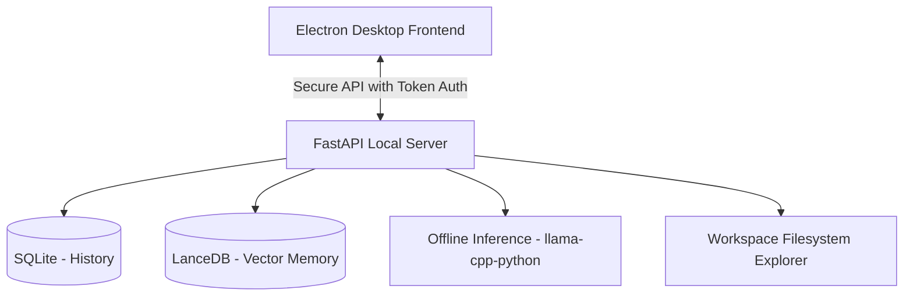

# Project Nana — Personal AI Companion Platform

Project Nana is a local-first, offline-capable AI companion and workspace platform. It combines long-term SQLite-backed memory, a local vector database, offline GGUF inference, and a sandboxed terminal/workspace environment in a premium Electron app wrapper.

## Architecture Overview



---

## Prerequisites

1. **Python 3.10+** (Python 3.12 recommended) installed on your system. Make sure **"Add python.exe to PATH"** is selected.
2. **Node.js** (v18+) for the Electron desktop client.
3. **Ollama** (optional, for registry model sync).

---

## Quickstart Setup

### 1. Diagnose Environment
Verify your system satisfies the runtime requirements before doing any installation:
```bash
npm run doctor
```

### 2. Configure Virtual Environment
Build and package the local dependencies by running the setup script in the project root:
* **PowerShell (Recommended):**
  ```powershell
  # Interactive setup (will prompt to pull default model)
  .\setup.ps1

  # Non-interactive / headless setup (skips model download prompts)
  .\setup.ps1 -SkipModels

  # Specify a custom model to pull via Ollama non-interactively
  .\setup.ps1 -Model qwen2.5-coder:3b
  ```
* **Command Prompt:**
  ```cmd
  setup.bat
  ```

### 3. Launch Developer Mode
To start both the FastAPI backend and the Electron desktop frontend:
```bash
npm run dev
```

---

## Development Scripts

* `npm run dev`: Launch the desktop companion app in development mode.
* `npm run doctor`: Check virtual environment, Python runnability, version, and local port status.
* `npm run desktop:build`: Compile the production portable package.
